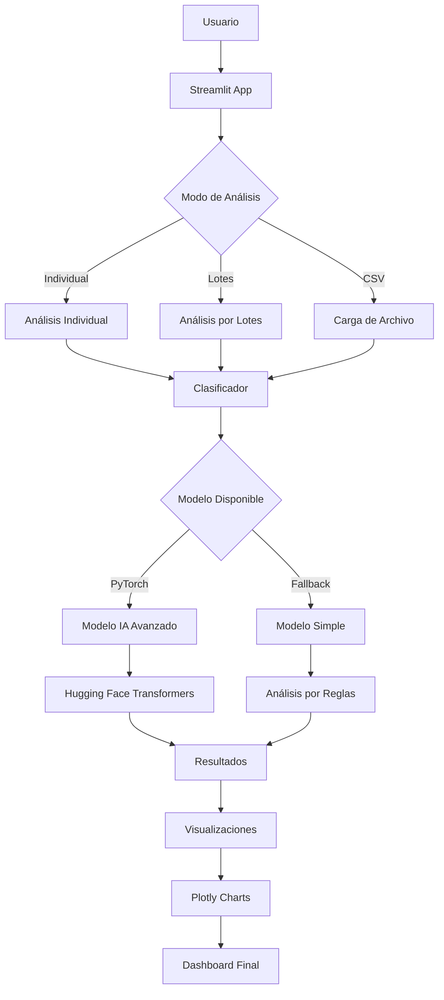

# 🧠 Smart Text Classifier

[](https://python.org)
[](https://streamlit.io)
[](https://huggingface.co)
[](LICENSE)

## 📋 Tabla de Contenidos
- [Descripción](#descripción)
- [Características](#características)
- [Tecnologías](#tecnologías)
- [Instalación](#instalación)
- [Uso](#uso)
- [Arquitectura](#arquitectura)
- [API Reference](#api-reference)
- [Ejemplos](#ejemplos)
- [Contribuciones](#contribuciones)
- [Licencia](#licencia)

## 🎯 Descripción

**Smart Text Classifier** es un sistema completo de análisis de sentimientos que combina inteligencia artificial avanzada con una interfaz web interactiva. El proyecto está diseñado para analizar el sentimiento de textos en múltiples idiomas, ofreciendo tanto análisis individual como por lotes.

### 🎯 Objetivos del Proyecto
- **Análisis de Sentimientos**: Clasificación automática de textos en POSITIVE, NEGATIVE, NEUTRAL
- **Interfaz Web**: Dashboard interactivo para usuarios no técnicos
- **Escalabilidad**: Soporte para análisis masivos de datos
- **Multilingüe**: Soporte para 6 idiomas principales
- **Flexibilidad**: Múltiples modos de análisis y visualización

## 🚀 Características

### ✨ **Funcionalidades Principales**
- ✅ **Análisis Individual**: Clasificación de texto único con métricas detalladas
- ✅ **Análisis por Lotes**: Procesamiento masivo de múltiples textos
- ✅ **Carga de CSV**: Importación y análisis de archivos de datos
- ✅ **Visualizaciones Interactivas**: Gráficos dinámicos con Plotly
- ✅ **Métricas Detalladas**: Estadísticas completas de análisis
- ✅ **Descarga de Resultados**: Exportación en formato CSV
- ✅ **Soporte Multilingüe**: 6 idiomas soportados

### 🌍 **Idiomas Soportados**
- 🇺🇸 **Inglés** (English)
- 🇪🇸 **Español** (Spanish)
- 🇫🇷 **Francés** (French)
- 🇩🇪 **Alemán** (German)
- 🇮🇹 **Italiano** (Italian)
- 🇵🇹 **Portugués** (Portuguese)

### 📊 **Modos de Análisis**
1. **Texto Individual**: Análisis de un texto específico
2. **Análisis por Lotes**: Procesamiento de múltiples textos
3. **Carga de Archivo CSV**: Importación masiva desde archivos

## 🛠️ Tecnologías

### **Backend & IA**
- **Python 3.11**: Lenguaje principal
- **PyTorch**: Framework de deep learning
- **Hugging Face Transformers**: Modelos pre-entrenados de IA
- **scikit-learn**: Machine learning tradicional
- **pandas**: Manipulación y análisis de datos
- **numpy**: Operaciones numéricas

### **Frontend & Visualización**
- **Streamlit**: Framework web para aplicaciones de datos
- **Plotly**: Gráficos interactivos y visualizaciones
- **matplotlib**: Visualizaciones estáticas

### **Procesamiento & Optimización**
- **sentencepiece**: Tokenización avanzada
- **accelerate**: Optimización de modelos
- **protobuf**: Serialización de datos

### **Patrones de Diseño**
- **Singleton Pattern**: Clasificador global único
- **Factory Pattern**: Creación de diferentes modelos
- **Strategy Pattern**: Análisis simple vs avanzado
- **Observer Pattern**: Métricas y logging

## 🚀 Instalación

### **Prerrequisitos**
- Python 3.11 o superior
- pip (gestor de paquetes de Python)
- Git (para clonar el repositorio)

### **Instalación Paso a Paso**

1. **Clonar el repositorio**
```bash
git clone https://github.com/tu-usuario/smart-text-classifier.git
cd smart-text-classifier
```

2. **Crear entorno virtual**
```bash
python -m venv venv
# Windows
venv\Scripts\activate
# Linux/Mac
source venv/bin/activate
```

3. **Instalar dependencias**
```bash
pip install -r requirements.txt
```

4. **Verificar instalación**
```bash
python -c "import streamlit; print('Streamlit instalado correctamente')"
```

### **Instalación Rápida**
```bash
# Instalación completa en un comando
git clone https://github.com/tu-usuario/smart-text-classifier.git && \
cd smart-text-classifier && \
python -m venv venv && \
venv\Scripts\activate && \
pip install -r requirements.txt
```

## 🎮 Uso

### **Ejecutar la Aplicación**

#### **Modo Simple (Recomendado para inicio)**
```bash
py -3.11 -m streamlit run app_simple.py
```

#### **Modo Avanzado (Requiere PyTorch)**
```bash
py -3.11 -m streamlit run app.py
```

### **Acceder a la Aplicación**
- **URL Local**: http://localhost:8501
- **URL de Red**: http://192.168.x.x:8501

### **Ejemplos de Uso**

#### **1. Análisis Individual**
```python
from model.predict_simple import classify_text

# Analizar un texto
texto = "I love this product! It's amazing!"
sentimiento, confianza = classify_text(texto)
print(f"Sentimiento: {sentimiento}, Confianza: {confianza}")
# Output: Sentimiento: POSITIVE, Confianza: 0.95
```

#### **2. Análisis por Lotes**
```python
from model.predict_simple import classify_batch

# Analizar múltiples textos
textos = [
    "I love this product!",
    "This is terrible!",
    "The weather is nice today."
]
resultados = classify_batch(textos)
print(resultados)
# Output: [('POSITIVE', 0.95), ('NEGATIVE', 0.90), ('NEUTRAL', 0.70)]
```

#### **3. Análisis con Umbral de Confianza**
```python
from model.predict_simple import classify_with_confidence_threshold

# Analizar con umbral personalizado
texto = "This is okay, nothing special."
sentimiento, confianza, nivel = classify_with_confidence_threshold(texto, 0.8)
print(f"Sentimiento: {sentimiento}, Confianza: {confianza}, Nivel: {nivel}")
# Output: Sentimiento: NEUTRAL, Confianza: 0.70, Nivel: Baja confianza
```

## 🏗️ Arquitectura

### **Estructura del Proyecto**
```
smart-text-classifier/
├── 📁 app.py                    # Aplicación principal (modo avanzado)
├── 📁 app_simple.py             # Aplicación simple (modo básico)
├── 📁 config.py                 # Configuración centralizada
├── 📁 utils.py                  # Utilidades y monitoreo
├── 📁 multilingual.py          # Soporte multilingüe
├── 📁 requirements.txt          # Dependencias del proyecto
├── 📁 README.md                 # Documentación principal
├── 📁 model/
│   ├── 📁 predict.py            # Clasificador avanzado
│   ├── 📁 predict_simple.py     # Clasificador simple
│   └── 📁 train.py             # Entrenamiento de modelos
├── 📁 data/
│   └── 📁 samples.csv           # Datos de ejemplo
└── 📁 docs/                     # Documentación adicional
    ├── 📁 architecture.md       # Arquitectura detallada
    ├── 📁 api_reference.md      # Referencia de API
    ├── 📁 deployment.md         # Guías de deployment
    └── 📁 examples.md           # Ejemplos de uso
```

### **Diagrama de Arquitectura**


### **Flujo de Datos**
1. **Entrada**: Usuario ingresa texto(s) o carga archivo
2. **Procesamiento**: Sistema selecciona modelo apropiado
3. **Análisis**: Clasificación de sentimientos con IA o reglas
4. **Visualización**: Generación de gráficos interactivos
5. **Salida**: Resultados con métricas y descarga

## 📚 API Reference

### **Clases Principales**

#### **SentimentClassifier**
```python
class SentimentClassifier:
    """Clasificador principal de sentimientos"""
    
    def __init__(self):
        """Inicializa el clasificador"""
        
    def classify_text(self, text: str) -> Tuple[str, float]:
        """Clasifica un texto individual"""
        
    def classify_batch(self, texts: List[str]) -> List[Tuple[str, float]]:
        """Clasifica múltiples textos"""
        
    def classify_with_confidence_threshold(self, text: str, threshold: float = 0.7) -> Tuple[str, float, str]:
        """Clasifica con umbral de confianza personalizado"""
```

#### **SimpleSentimentClassifier**
```python
class SimpleSentimentClassifier:
    """Clasificador simple basado en reglas"""
    
    def __init__(self):
        """Inicializa el clasificador simple"""
        
    def classify_text(self, text: str) -> Tuple[str, float]:
        """Clasifica usando reglas predefinidas"""
```

#### **MultilingualSentimentClassifier**
```python
class MultilingualSentimentClassifier:
    """Clasificador multilingüe"""
    
    def detect_language(self, text: str) -> str:
        """Detecta el idioma del texto"""
        
    def classify_text(self, text: str, lang: str = None) -> Tuple[str, float]:
        """Clasifica texto en idioma específico"""
```

### **Funciones de Utilidad**

#### **PerformanceMonitor**
```python
class PerformanceMonitor:
    """Monitor de rendimiento del sistema"""
    
    def start_timer(self):
        """Inicia el cronómetro"""
        
    def stop_timer(self):
        """Detiene el cronómetro"""
        
    def get_elapsed_time(self) -> float:
        """Obtiene tiempo transcurrido"""
        
    def get_processing_rate(self, num_items: int) -> float:
        """Calcula tasa de procesamiento"""
```

## 📊 Ejemplos

### **Ejemplo 1: Análisis Básico**
```python
# Importar funciones
from model.predict_simple import classify_text, classify_batch

# Analizar texto individual
texto = "I love this product! It's amazing!"
sentimiento, confianza = classify_text(texto)
print(f"Resultado: {sentimiento} (confianza: {confianza:.3f})")

# Analizar múltiples textos
textos = [
    "This is wonderful!",
    "I hate this!",
    "It's okay, nothing special."
]
resultados = classify_batch(textos)
for i, (sent, conf) in enumerate(resultados):
    print(f"Texto {i+1}: {sent} (confianza: {conf:.3f})")
```

### **Ejemplo 2: Análisis con Umbral**
```python
from model.predict_simple import classify_with_confidence_threshold

# Analizar con umbral personalizado
texto = "This is okay, nothing special."
sentimiento, confianza, nivel = classify_with_confidence_threshold(texto, 0.8)

print(f"Sentimiento: {sentimiento}")
print(f"Confianza: {confianza:.3f}")
print(f"Nivel de confianza: {nivel}")
```

### **Ejemplo 3: Análisis Multilingüe**
```python
from multilingual import classify_text_multilingual, detect_language

# Detectar idioma
texto_es = "Me encanta este producto!"
idioma = detect_language(texto_es)
print(f"Idioma detectado: {idioma}")

# Clasificar en idioma específico
sentimiento, confianza = classify_text_multilingual(texto_es, "es")
print(f"Sentimiento: {sentimiento} (confianza: {confianza:.3f})")
```

### **Ejemplo 4: Uso en Streamlit**
```python
import streamlit as st
from model.predict_simple import classify_text

# Interfaz simple
st.title("Análisis de Sentimientos")
texto = st.text_area("Ingresa tu texto:")
if st.button("Analizar"):
    sentimiento, confianza = classify_text(texto)
    st.success(f"Sentimiento: {sentimiento} (confianza: {confianza:.3f})")
```

## 🚀 Deployment

### **Deployment Local**
```bash
# Ejecutar aplicación
py -3.11 -m streamlit run app_simple.py

# Acceder en navegador
# http://localhost:8501
```

### **Deployment en Cloud**

#### **Streamlit Cloud**
1. Subir código a GitHub
2. Conectar con Streamlit Cloud
3. Configurar variables de entorno
4. Deploy automático

#### **Docker**
```dockerfile
FROM python:3.11-slim
WORKDIR /app
COPY requirements.txt .
RUN pip install -r requirements.txt
COPY . .
EXPOSE 8501
CMD ["streamlit", "run", "app_simple.py"]
```

#### **Heroku**
```bash
# Crear Procfile
echo "web: streamlit run app_simple.py --server.port=$PORT" > Procfile

# Deploy
git add .
git commit -m "Deploy to Heroku"
git push heroku main
```

## 🧪 Testing

### **Ejecutar Tests**
```bash
# Test básico
python -c "from model.predict_simple import classify_text; print('Test OK')"

# Test completo
python -m pytest tests/ -v
```

### **Test de Rendimiento**
```python
import time
from model.predict_simple import classify_batch

# Medir rendimiento
textos = ["Test text"] * 100
start_time = time.time()
resultados = classify_batch(textos)
end_time = time.time()

print(f"Procesados: {len(textos)} textos")
print(f"Tiempo: {end_time - start_time:.2f} segundos")
print(f"Velocidad: {len(textos)/(end_time - start_time):.2f} textos/segundo")
```

## 🤝 Contribuciones

### **Cómo Contribuir**
1. Fork del repositorio
2. Crear rama feature (`git checkout -b feature/nueva-funcionalidad`)
3. Commit cambios (`git commit -m 'Agregar nueva funcionalidad'`)
4. Push a la rama (`git push origin feature/nueva-funcionalidad`)
5. Crear Pull Request

### **Áreas de Contribución**
- 🐛 **Bug fixes**: Corrección de errores
- ✨ **Nuevas funcionalidades**: Mejoras y características
- 📚 **Documentación**: Mejoras en documentación
- 🧪 **Tests**: Cobertura de pruebas
- 🌍 **Idiomas**: Soporte para nuevos idiomas

### **Estándares de Código**
- **PEP 8**: Estilo de código Python
- **Type Hints**: Tipado estático
- **Docstrings**: Documentación de funciones
- **Tests**: Cobertura mínima del 80%

## 📈 Roadmap

### **Versión 1.1 (Próxima)**
- [ ] Soporte para más idiomas
- [ ] Mejoras en visualizaciones
- [ ] API REST
- [ ] Dockerización

### **Versión 1.2 (Futuro)**
- [ ] Análisis de emociones
- [ ] Integración con bases de datos
- [ ] Dashboard de administración
- [ ] Análisis en tiempo real

### **Versión 2.0 (Largo plazo)**
- [ ] Modelos personalizados
- [ ] Análisis de sentimientos por dominio
- [ ] Integración con LLMs
- [ ] Análisis multimodal

## 🐛 Troubleshooting

### **Problemas Comunes**

#### **Error de PyTorch**
```bash
# Solución: Usar modelo simple
py -3.11 -m streamlit run app_simple.py
```

#### **Error de Dependencias**
```bash
# Reinstalar dependencias
pip uninstall -r requirements.txt -y
pip install -r requirements.txt
```

#### **Error de Puerto**
```bash
# Cambiar puerto
streamlit run app_simple.py --server.port 8502
```

### **Logs y Debugging**
```python
import logging
logging.basicConfig(level=logging.DEBUG)

# Ver logs detallados
logger = logging.getLogger(__name__)
logger.debug("Mensaje de debug")
```

## 📞 Soporte

### **Obtener Ayuda**
- 📧 **Email**: andrey.beltran28@gmail.com
- 🐛 **Issues**: [GitHub Issues](https://github.com/tu-usuario/smart-text-classifier/issues)
- 💬 **Discusiones**: [GitHub Discussions](https://github.com/tu-usuario/smart-text-classifier/discussions)

