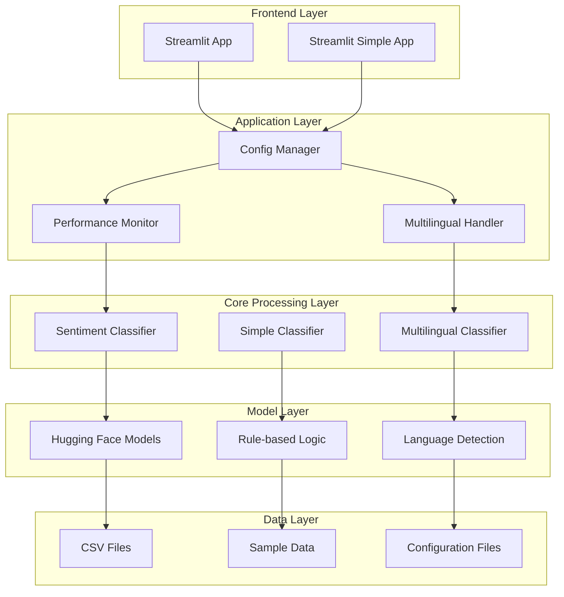
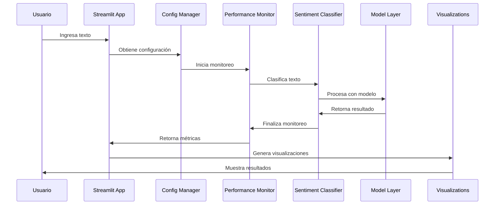
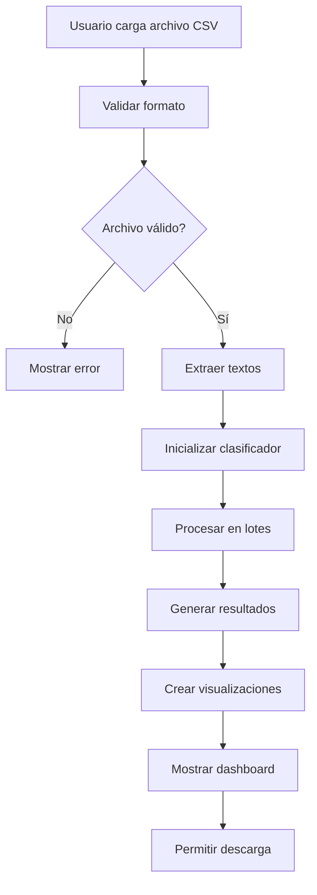

# 🏗️ Arquitectura del Sistema - Smart Text Classifier

## 📋 Tabla de Contenidos
- [Visión General](#visión-general)
- [Arquitectura de Alto Nivel](#arquitectura-de-alto-nivel)
- [Componentes del Sistema](#componentes-del-sistema)
- [Flujo de Datos](#flujo-de-datos)
- [Patrones de Diseño](#patrones-de-diseño)
- [Estructura de Archivos](#estructura-de-archivos)
- [Configuración](#configuración)
- [Monitoreo y Logging](#monitoreo-y-logging)

## 🎯 Visión General

El **Smart Text Classifier** implementa una arquitectura modular y escalable que combina múltiples enfoques de análisis de sentimientos:

- **Análisis Simple**: Basado en reglas para casos básicos
- **Análisis Avanzado**: Usando modelos de IA pre-entrenados
- **Análisis Multilingüe**: Soporte para múltiples idiomas
- **Interfaz Web**: Dashboard interactivo con Streamlit

## 🏗️ Arquitectura de Alto Nivel



## 🔧 Componentes del Sistema

### **1. Frontend Layer**

#### **Streamlit Applications**
- **`app.py`**: Aplicación principal con funcionalidades avanzadas
- **`app_simple.py`**: Aplicación simplificada para casos básicos

**Características:**
- Interfaz web interactiva
- Múltiples modos de análisis
- Visualizaciones dinámicas
- Descarga de resultados

### **2. Application Layer**

#### **Config Manager (`config.py`)**
```python
class Config:
    """Configuración centralizada del sistema"""
    
    # Modelos de IA
    MODEL_NAME = "distilbert-base-uncased-finetuned-sst-2-english"
    MULTILINGUAL_MODELS = {
        "en": "distilbert-base-uncased-finetuned-sst-2-english",
        "es": "dccuchile/bert-base-spanish-wwm-cased-finetuned-sentiment-spanish",
        # ... más idiomas
    }
    
    # Parámetros de procesamiento
    CONFIDENCE_THRESHOLD = 0.7
    MAX_LENGTH = 128
    BATCH_SIZE = 32
```

#### **Performance Monitor (`utils.py`)**
```python
class PerformanceMonitor:
    """Monitor de rendimiento del sistema"""
    
    def start_timer(self):
        """Inicia el cronómetro"""
        
    def stop_timer(self):
        """Detiene el cronómetro"""
        
    def get_elapsed_time(self) -> float:
        """Obtiene tiempo transcurrido"""
        
    def get_processing_rate(self, num_items: int) -> float:
        """Calcula tasa de procesamiento"""
```

#### **Multilingual Handler (`multilingual.py`)**
```python
class MultilingualSentimentClassifier:
    """Manejador de análisis multilingüe"""
    
    def detect_language(self, text: str) -> str:
        """Detecta el idioma del texto"""
        
    def classify_text(self, text: str, lang: str = None) -> Tuple[str, float]:
        """Clasifica texto en idioma específico"""
        
    def classify_batch(self, texts: List[str], langs: List[str] = None) -> List[Tuple[str, float]]:
        """Clasifica múltiples textos multilingües"""
```

### **3. Core Processing Layer**

#### **Sentiment Classifier (`model/predict.py`)**
```python
class SentimentClassifier:
    """Clasificador principal de sentimientos"""
    
    def __init__(self):
        """Inicializa el clasificador con modelo de IA"""
        
    def classify_text(self, text: str) -> Tuple[str, float]:
        """Clasifica un texto individual"""
        
    def classify_batch(self, texts: List[str]) -> List[Tuple[str, float]]:
        """Clasifica múltiples textos"""
        
    def classify_with_confidence_threshold(self, text: str, threshold: float = 0.7) -> Tuple[str, float, str]:
        """Clasifica con umbral de confianza personalizado"""
```

#### **Simple Classifier (`model/predict_simple.py`)**
```python
class SimpleSentimentClassifier:
    """Clasificador simple basado en reglas"""
    
    def __init__(self):
        """Inicializa con palabras clave predefinidas"""
        
    def classify_text(self, text: str) -> Tuple[str, float]:
        """Clasifica usando reglas predefinidas"""
        
    def classify_batch(self, texts: List[str]) -> List[Tuple[str, float]]:
        """Clasifica múltiples textos con reglas"""
```

### **4. Model Layer**

#### **Hugging Face Models**
- **DistilBERT**: Modelo base para inglés
- **BERT Multilingual**: Soporte multilingüe
- **Modelos Específicos**: Por idioma (español, francés, etc.)

#### **Rule-based Logic**
- **Palabras Positivas**: Lista de términos positivos
- **Palabras Negativas**: Lista de términos negativos
- **Palabras Neutrales**: Lista de términos neutrales

#### **Language Detection**
- **langdetect**: Biblioteca para detección de idiomas
- **Fallback**: Inglés como idioma por defecto

### **5. Data Layer**

#### **Data Sources**
- **CSV Files**: Archivos de entrada del usuario
- **Sample Data**: Datos de ejemplo predefinidos
- **Configuration Files**: Archivos de configuración

## 🔄 Flujo de Datos

### **Flujo Principal de Análisis**



### **Flujo de Análisis por Lotes**



## 🎨 Patrones de Diseño

### **1. Singleton Pattern**
```python
class SentimentClassifier:
    _instance = None
    
    def __new__(cls):
        if cls._instance is None:
            cls._instance = super().__new__(cls)
        return cls._instance
```

**Uso**: Asegura una única instancia del clasificador en toda la aplicación.

### **2. Factory Pattern**
```python
def get_classifier(classifier_type: str) -> BaseClassifier:
    """Factory para crear clasificadores"""
    if classifier_type == "simple":
        return SimpleSentimentClassifier()
    elif classifier_type == "advanced":
        return SentimentClassifier()
    elif classifier_type == "multilingual":
        return MultilingualSentimentClassifier()
```

**Uso**: Crea diferentes tipos de clasificadores según las necesidades.

### **3. Strategy Pattern**
```python
class ClassificationStrategy:
    """Estrategia base para clasificación"""
    
    def classify(self, text: str) -> Tuple[str, float]:
        raise NotImplementedError

class RuleBasedStrategy(ClassificationStrategy):
    """Estrategia basada en reglas"""
    
    def classify(self, text: str) -> Tuple[str, float]:
        # Implementación basada en reglas
        pass

class AIBasedStrategy(ClassificationStrategy):
    """Estrategia basada en IA"""
    
    def classify(self, text: str) -> Tuple[str, float]:
        # Implementación basada en IA
        pass
```

**Uso**: Permite cambiar el algoritmo de clasificación dinámicamente.

### **4. Observer Pattern**
```python
class PerformanceObserver:
    """Observador de rendimiento"""
    
    def update(self, metrics: dict):
        """Actualiza métricas de rendimiento"""
        pass

class LoggingObserver(PerformanceObserver):
    """Observador para logging"""
    
    def update(self, metrics: dict):
        logger.info(f"Performance metrics: {metrics}")
```

**Uso**: Monitorea y registra métricas de rendimiento del sistema.

## 📁 Estructura de Archivos

```
smart-text-classifier/
├── 📁 app.py                    # Aplicación principal
├── 📁 app_simple.py             # Aplicación simplificada
├── 📁 config.py                 # Configuración centralizada
├── 📁 utils.py                  # Utilidades y monitoreo
├── 📁 multilingual.py          # Soporte multilingüe
├── 📁 requirements.txt          # Dependencias
├── 📁 README.md                 # Documentación principal
├── 📁 model/
│   ├── 📁 __init__.py           # Inicialización del módulo
│   ├── 📁 predict.py            # Clasificador avanzado
│   ├── 📁 predict_simple.py     # Clasificador simple
│   └── 📁 train.py             # Entrenamiento de modelos
├── 📁 data/
│   └── 📁 samples.csv           # Datos de ejemplo
├── 📁 docs/                     # Documentación adicional
│   ├── 📁 architecture.md       # Este archivo
│   ├── 📁 api_reference.md      # Referencia de API
│   ├── 📁 deployment.md         # Guías de deployment
│   └── 📁 examples.md           # Ejemplos de uso
└── 📁 tests/                    # Pruebas unitarias
    ├── 📁 test_predict.py       # Tests del clasificador
    ├── 📁 test_multilingual.py  # Tests multilingües
    └── 📁 test_utils.py         # Tests de utilidades
```

## ⚙️ Configuración

### **Configuración Centralizada**

El sistema utiliza un patrón de configuración centralizada en `config.py`:

```python
class Config:
    """Configuración centralizada del sistema"""
    
    # Modelos de IA
    MODEL_NAME = "distilbert-base-uncased-finetuned-sst-2-english"
    MULTILINGUAL_MODELS = {
        "en": "distilbert-base-uncased-finetuned-sst-2-english",
        "es": "dccuchile/bert-base-spanish-wwm-cased-finetuned-sentiment-spanish",
        "fr": "nlptown/bert-base-multilingual-uncased-sentiment",
        "de": "nlptown/bert-base-multilingual-uncased-sentiment",
        "it": "nlptown/bert-base-multilingual-uncased-sentiment",
        "pt": "nlptown/bert-base-multilingual-uncased-sentiment"
    }
    
    # Parámetros de procesamiento
    CONFIDENCE_THRESHOLD = 0.7
    MAX_LENGTH = 128
    BATCH_SIZE = 32
    
    # Configuración de logging
    LOG_LEVEL = "INFO"
    LOG_FORMAT = "%(asctime)s - %(name)s - %(levelname)s - %(message)s"
    
    # Configuración de Streamlit
    STREAMLIT_THEME = "light"
    STREAMLIT_LAYOUT = "wide"
```

### **Variables de Entorno**

```bash
# Configuración de modelos
MODEL_NAME=distilbert-base-uncased-finetuned-sst-2-english
CONFIDENCE_THRESHOLD=0.7
MAX_LENGTH=128
BATCH_SIZE=32

# Configuración de logging
LOG_LEVEL=INFO
LOG_FILE=logs/app.log

# Configuración de Streamlit
STREAMLIT_THEME=light
STREAMLIT_LAYOUT=wide
```

## 📊 Monitoreo y Logging

### **Sistema de Logging**

```python
import logging
from config import Config

# Configuración de logging
logging.basicConfig(
    level=getattr(logging, Config.LOG_LEVEL),
    format=Config.LOG_FORMAT,
    handlers=[
        logging.FileHandler('logs/app.log'),
        logging.StreamHandler()
    ]
)

logger = logging.getLogger(__name__)
```

### **Métricas de Rendimiento**

```python
class PerformanceMetrics:
    """Métricas de rendimiento del sistema"""
    
    def __init__(self):
        self.total_requests = 0
        self.total_processing_time = 0
        self.average_response_time = 0
        self.requests_per_second = 0
        
    def update_metrics(self, processing_time: float):
        """Actualiza métricas de rendimiento"""
        self.total_requests += 1
        self.total_processing_time += processing_time
        self.average_response_time = self.total_processing_time / self.total_requests
        self.requests_per_second = self.total_requests / (self.total_processing_time / 60)
```

### **Monitoreo en Tiempo Real**

```python
class RealTimeMonitor:
    """Monitor en tiempo real del sistema"""
    
    def __init__(self):
        self.metrics = PerformanceMetrics()
        self.observers = []
        
    def add_observer(self, observer: PerformanceObserver):
        """Agrega un observador"""
        self.observers.append(observer)
        
    def notify_observers(self, metrics: dict):
        """Notifica a todos los observadores"""
        for observer in self.observers:
            observer.update(metrics)
```

## 🔒 Seguridad y Validación

### **Validación de Entrada**

```python
def validate_text_input(text: str) -> bool:
    """Valida la entrada de texto"""
    if not text or not text.strip():
        return False
    
    if len(text) > 10000:  # Límite de caracteres
        return False
        
    # Validar caracteres especiales
    if any(char in text for char in ['<', '>', '&']):
        return False
        
    return True
```

### **Sanitización de Datos**

```python
def sanitize_text(text: str) -> str:
    """Sanitiza el texto de entrada"""
    # Remover caracteres peligrosos
    dangerous_chars = ['<', '>', '&', '"', "'"]
    for char in dangerous_chars:
        text = text.replace(char, '')
    
    # Limitar longitud
    text = text[:10000]
    
    return text.strip()
```

## 🚀 Escalabilidad y Optimización

### **Optimizaciones Implementadas**

1. **Caching de Modelos**: Los modelos se cargan una sola vez
2. **Procesamiento por Lotes**: Optimización para múltiples textos
3. **Lazy Loading**: Carga diferida de componentes
4. **Connection Pooling**: Reutilización de conexiones

### **Estrategias de Escalabilidad**

1. **Horizontal Scaling**: Múltiples instancias de la aplicación
2. **Load Balancing**: Distribución de carga
3. **Caching**: Redis para caché de resultados
4. **Database Optimization**: Índices y consultas optimizadas

## 🔧 Mantenimiento y Actualizaciones

### **Versionado**

```python
__version__ = "1.0.0"
__author__ = "Tu Nombre"
__email__ = "tu-email@ejemplo.com"
```

### **Changelog**

```markdown
# Changelog

## [1.0.0] - 2024-01-01
### Added
- Análisis de sentimientos básico
- Interfaz web con Streamlit
- Soporte multilingüe
- Visualizaciones interactivas

### Changed
- Mejorada la arquitectura del sistema
- Optimizado el rendimiento

### Fixed
- Corregidos errores de PyTorch
- Mejorada la detección de idiomas
```

---

**Esta arquitectura proporciona una base sólida y escalable para el análisis de sentimientos, permitiendo futuras mejoras y extensiones del sistema.**
